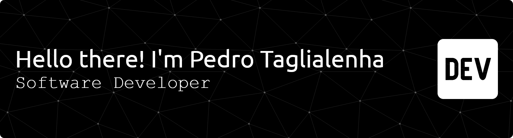

### Here is a little about me

<p align="left">
  I'm a Computer Science undergraduate at UFSC, focusing on secure systems development. I have hands-on experience in C++, Python, and Go, with a strong foundation in applied cryptography, mobile security, and blockchain-based identity. I am actively seeking challenging opportunities where I can apply and expand my skill set.
</p>

```yaml
personal_info:
  name: Pedro Henrique de Sena Trombini Taglialenha
  location: Florianópolis, Brasil
  
current_status:
  role: "Software Developer"
  organization: "LabSEC @ Federal University of Santa Catarina (UFSC)"

education:
  degree: "Bachelor's in Computer Science"
  university: "Federal University of Santa Catarina (UFSC)"
  expected_graduation: 2026

interests:
  - Offensive Security & Pentesting
```
---


---

### Languages and tools I worked with 

<p align="left">
  <!-- Language Icons -->
  <a href="https://skillicons.dev">
    
  </a>
  <br>
  <!-- Tool Icons -->
  <a href="https://skillicons.dev">
    
  </a>
</p>

---

### 🏆 Key Projects & Achievements

<table>
  <tr>
    <td width="50%">
      <h4 align="center">ConfirmaID (1st Place Hackathon Winner)</h4>
      <p>Led the development of a Flutter app for secure identity validation using digital signatures and national PKI APIs. The project won 1st place in the SECCOM university hackathon.</p>
      <p align="center">
      <a href="https://github.com/Soul-Legend/HackatonFlutter2024">View Project</a>
      </p>
    </td>
    <td width="50%">
      <h4 align="center">Competitive Programming (ICPC/SBC)</h4>
      <p>Represented UFSC in regional programming contests, achieving a top-100 national placement in the 2022 SBC Programming Marathon.</p>
    </td>
  </tr>
</table>

###  I'm Currently Exploring...

-   Verifiable credentials and Zero Knowledge proofs

---

### Contact Info

<p align="left">
<a href="https://www.linkedin.com/in/pedro-henrique-taglialenha-058491211/" target="_blank"></a>
<a href="mailto:phtaglialenha@gmail.com"></a>
</p>

<p align="center">
  
</p>
